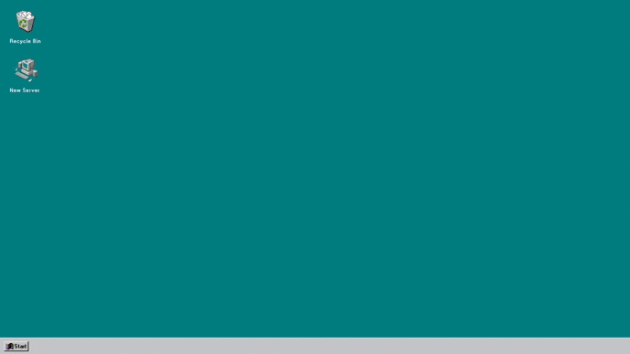

# Innovid challenge: Load balancer
Tenemos que crear una aplicación que muestre la carga de nuestros servidores 1, 2, 3 y 4, lamentablemente nuestro backend no tiene implementado un método para obtenerlos todos al mismo tiempo así que hay que traerlos de a uno, en paralelo.

## API
* GET https://localhost:8000/status/:id -> Obtiene la carga de un servidor

## Frontend
* Debe mostrar la carga de los cuatro servidores.
* La carga se debe actualizar cada 5 segundos.
* Puedo prender y apagar servidores (dejo de traerme su carga).

## Tenologias
* React JS
* Typescript
* Sass

## Corriendo el proyecto
```bash
# Instalar dependencias del proyecto
npm install

# Instalar dependencias de los paquetes
npm run bootstrap

# Correr el servidor de desarrollo
npm start
```

<b>Twitch:</b> EzeGonzalez12_ <br/>
<b>Discord:</b> Eze Gonzalez#5104 <br/>
<b>Contacto:</b> ezegonzalez912@gmail.com <br/>
